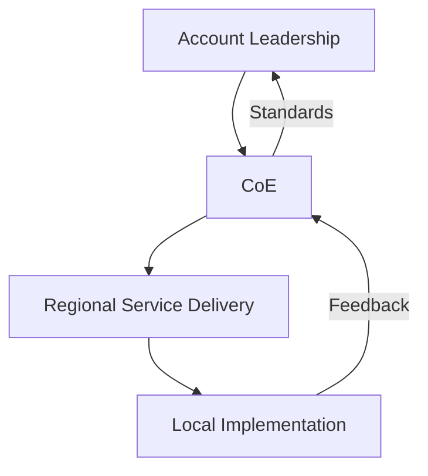
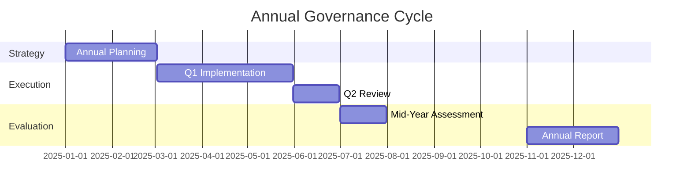
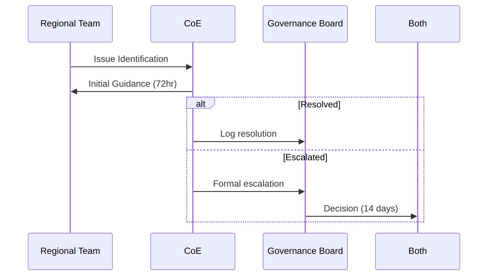

# Corporate Fitness Governance Framework

## Governance Structure

## Decision Rights Matrix
| Decision Type                | CoE Authority | Regional Authority | Joint Decision |
|------------------------------|---------------|--------------------|----------------|
| Program Design               | Primary       | Consultation       | Member Input   |
| Local Adaptation             | Guidelines    | Primary            | N/A            |
| Budget Allocation            | Framework     | Implementation     | Thresholds     |
| Staff Development            | Standards     | Execution          | Metrics        |
| Technology Adoption          | Primary       | Input              | Rollout Plan   |
| Facility Management          | Guidelines    | Primary            | Safety Issues  |

## Compliance Framework
### Three Lines of Defense
1. **First Line**: Regional self-assessments (Monthly)
2. **Second Line**: CoE quality audits (Quarterly)
3. **Third Line**: Independent reviews (Biannual)

## Performance Governance

## Key Governance Mechanisms
1. **Strategic Alignment**
   - CoE develops global standards
   - Regions adapt within 10% variance allowance
   - Joint approval required for >10% deviations

2. **Financial Governance**
   - CoE sets budget frameworks
   - Regions manage operational budgets
   - >$50k expenditures require CoE approval

3. **Risk Management**
   - Unified risk register
   - Regional risk assessments (Quarterly)
   - CoE risk mitigation strategies

4. **Performance Monitoring**
   | Metric Type           | CoE Metrics          | Regional Metrics       |
   |-----------------------|----------------------|-----------------------|
   | Operational           | Standard compliance  | Facility utilization   |
   | Financial             | Budget adherence     | Cost efficiency        |
   | Member Experience     | Global NPS           | Local satisfaction     |
   | Staff Development      | Certification rates  | Training completion    |

## Escalation Protocol

## Change Control Process
1. Request Submission
2. Impact Assessment (CoE + Region)
3. Approval Committee Review
4. Implementation Planning
5. Post-Implementation Review

## Technology Governance
| System Type             | CoE Oversight        | Regional Control      |
|-------------------------|----------------------|-----------------------|
| Core Platforms          | Full                 | Configuration         |
| Regional Tools          | Standards            | Implementation        |
| Data Analytics          | Framework            | Local reporting       |
| Member Facing Tech      | UX Standards         | Content management    |

