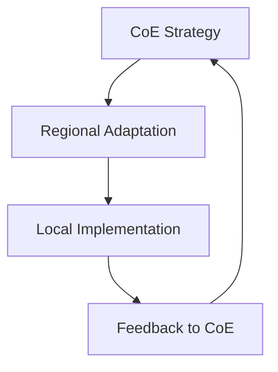
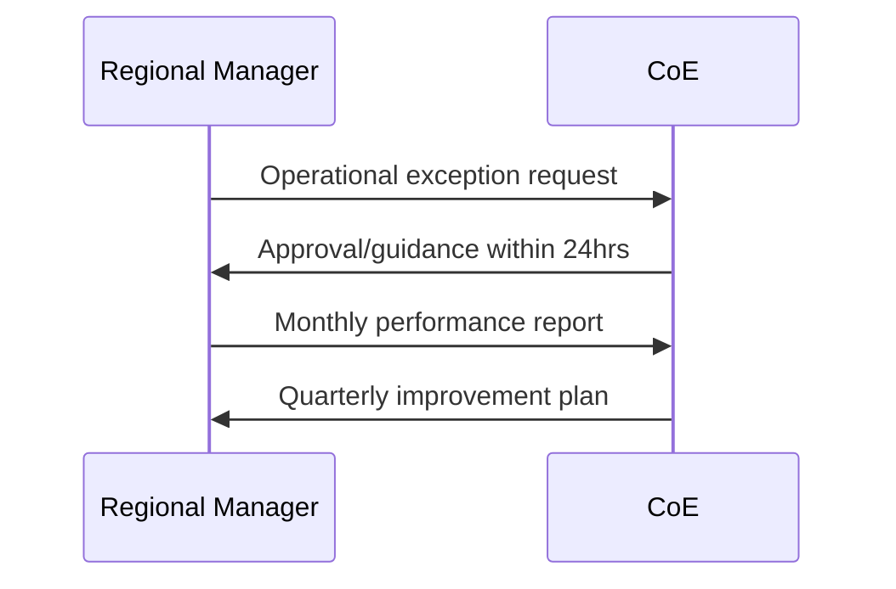

# Regional Service Delivery Manager Roles (CoE-Aligned)

## Governance Framework


## Role Alignment Matrix
| Role | CoE Partnership Aspect | Regional Execution Responsibility |
|------|-------------------------|------------------------------------|
| **Community Manager** | Implements CoE community engagement framework | Adapts to local cultural needs while maintaining brand standards |
| **Performance Manager** | Follows CoE competency models | Manages regional staff development |
| **Operations Manager** | Adheres to CoE facility standards | Manages site-specific operations |
| **Events Manager** | Uses CoE event playbooks | Executes regionally relevant events |

## CoE-Aligned Responsibilities

### Community Manager
**CoE Partnership:**
- Implement global community engagement framework
- Adhere to CoE brand guidelines
- Submit monthly participation metrics

**Regional Execution:**
- Localize content for cultural relevance
- Manage regional community leaders
- Adapt programming schedules

### Performance Manager
**CoE Partnership:**
- Enforce CoE competency standards
- Implement global training programs
- Use CoE evaluation tools

**Regional Execution:**
- Conduct local skill assessments
- Manage regional coaching schedules
- Adapt training delivery methods

### Operations Manager
**CoE Partnership:**
- Maintain CoE facility standards
- Implement global safety protocols
- Use approved vendor list

**Regional Execution:**
- Manage local maintenance budgets
- Coordinate regional supply chain
- Handle site-specific operations

### Events Manager
**CoE Partnership:**
- Follow CoE event playbooks
- Use global branding packages
- Submit post-event reports

**Regional Execution:**
- Plan local event calendars
- Manage regional vendor relations
- Adapt event timing

## Collaboration Protocol
1. **Monthly Alignment Sessions**
2. **Quarterly Compliance Audits**
3. **Annual Strategy Reviews**
4. **Continuous Feedback Loops**

## Escalation Matrix


## Key Performance Indicators
| Role | CoE Metrics | Regional Metrics |
|------|-------------|------------------|
| Community | Global participation | Local engagement |
| Performance | Certification rates | Staff retention |
| Operations | Standard compliance | Facility uptime |
| Events | Brand adherence | Local attendance |

This structure maintains CoE standards while allowing regional flexibility, with clear escalation paths and shared KPIs.

## SD Team (managers) Collaboration Framework
1. **Planning Cycle Integration**
```markdown
Community Goals → Event Calendar → Operational Support Needs → Staffing Requirements
↑                                     ↓                               ↓
└──────────Performance Tracking ←───┴─────────Operational Feedback ←───┘